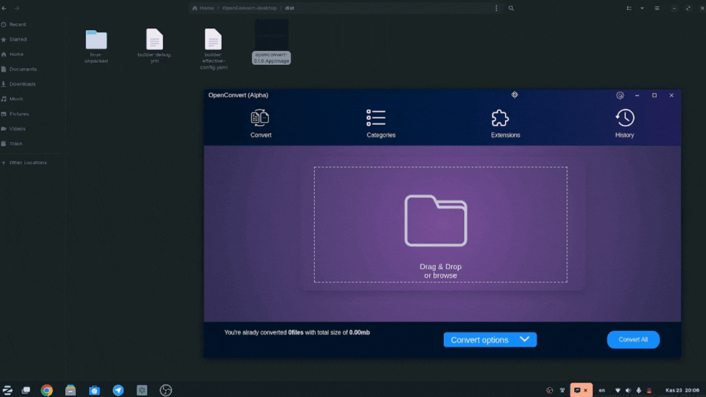

<h1 align="center">
  <br>
  <a href="https://github.com/openconvert"></a>
  <br>
  OpenConvert
  <br>
  <br>
</h1>

<h4 align="center">OpenConvert is your swiss army knife for file convertion</h4>

## Technologies
**OpenConvert** written in purely **html,css,javascrip** and Electronjs framework. Database json based (switching to [SQLite](https://sqlite.org))
## Features
- Convert multiple files at once
- Convert files to different formats
- Responsive Ui
## Install
There is one additional step required before installing.<br>
Install **[ffmpeg](https://ffmpeg.org)** for video and audio convertion<br>
- Windows `winget install --id=Gyan.FFmpeg  -e ` <br>
- Linux: `apt install ffmpeg`
- and then download executables from **[here](https://github.com/OpenConvert/OpenConvert-desktop/releases)**
## Screenshot

<p align="center">
  
</p>

## Supported files
- Image: png, jpg, gif, webp, jxl, bmp, avif, tiff
- Video: mp4, mkv, avi, mov, gif, 3gp
- Audio: aac, mp3, mp4a, wav
## How to Contribute
We need designer, tester and contributers. **OpenConvert** is prototype. If you want to contribute read [this](./CONTRIBUTING.md)
### Install dependencies

```
$ npm install
```

### Run app

```
$ npm start
```

### Package app

To build for windows:

```
$ npm run package-win
```
To build for linux:
```
npm run package-linux
```
*There is problem with linux builds, packaged application size is very big (1gb around).Planning to switch another packager


## License

GNU GPLv3
