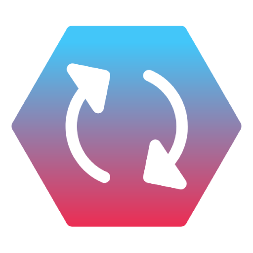

<h1 align="center">
  <br>
  <a href="https://github.com/openconvert"></a>
  <br>
</h1>

<h4 align="center">OpenConvert is your swiss army knife for file convertion</h4>


## Features
- Convert multiple files at once
- One click install in windows
- Responsive Ui
## Install
- For executables checkout our [website](https://openconvert.github.io/website) or release [page](https://github.com/openconvert/openconvert-desktop/releases)
<!-- ## Demo -->


## Supported files
- Image: png, jpg, gif, webp, jxl, bmp, avif, tiff
- ~~Video: mp4, mkv, avi, mov, gif, 3gp~~
- ~~Audio: aac, mp3, mp4a, wav~~
## 🛠 Tech stack
 - Electronjs
 - Vuejs
 - Tailwindcss 
 - Vite
 - daisyUI (component library)
## How to Contribute
We need designer, tester and contributers. **OpenConvert** is prototype. If you want to contribute read [this](./CONTRIBUTING.md)
### Install dependencies

```
$ pnpm install
```

### Run app

```
$ pnpm run start
```
### Run dev server
```
$ pnpm run dev
```
### Package app

To build for windows:

```
$ pnpm run build:win
```
To build for linux:
```
$ pnpm run build:linux
```
To build for mac:
```
$ pnpm build:mac
```


## License

GNU GPLv3
